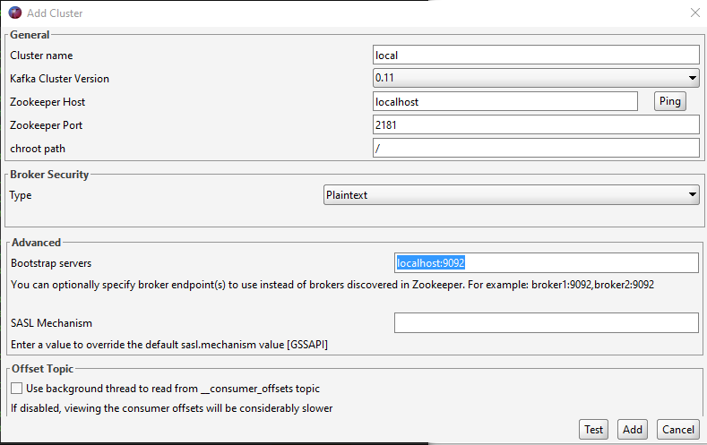

# kafka-demo

## Kafka Tool
kafka tool is a great way to explore kafka. Get version 2 [Kafka Tool](http://www.kafkatool.com/download.html) 

### Add the cluster

## Link
- [Confluent Github](https://github.com/confluentinc)
- [docker-compose](https://github.com/simplesteph/kafka-stack-docker-compose/blob/master/zk-single-kafka-single.yml)
- [Kafka Tool](http://www.kafkatool.com/download.html) use version 2